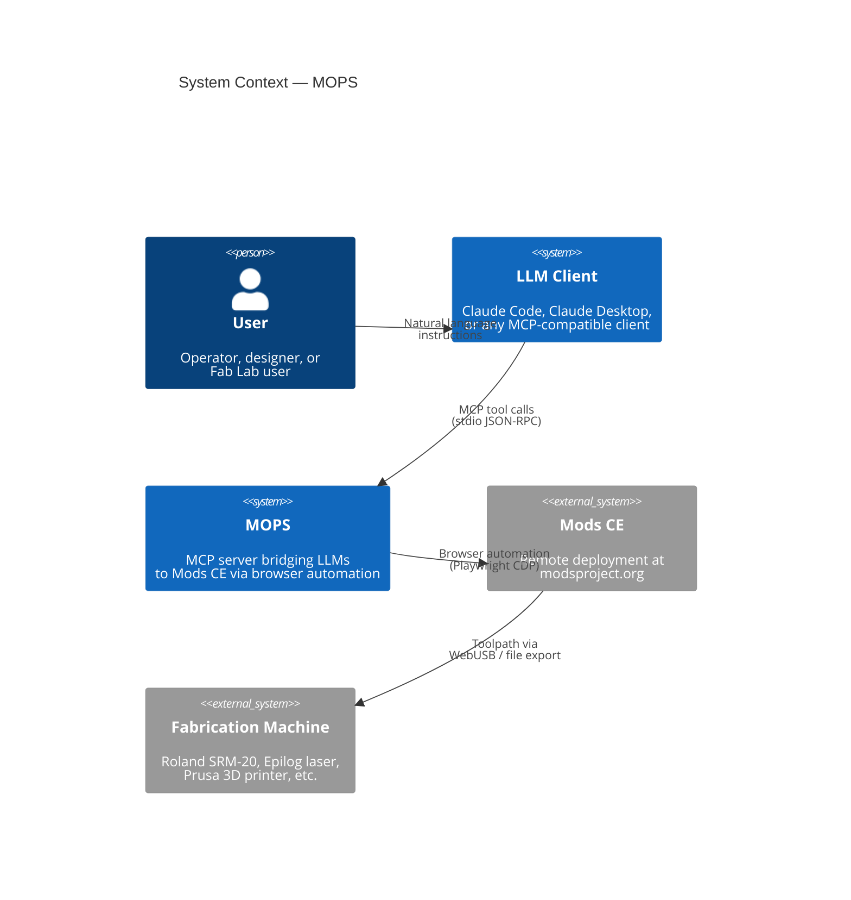
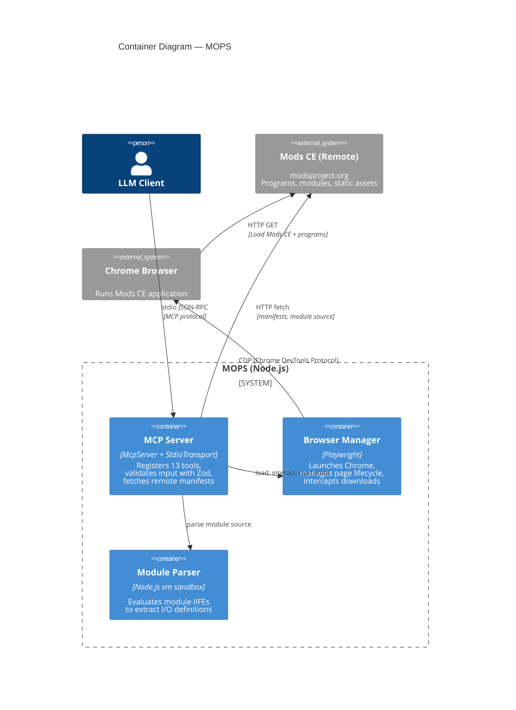
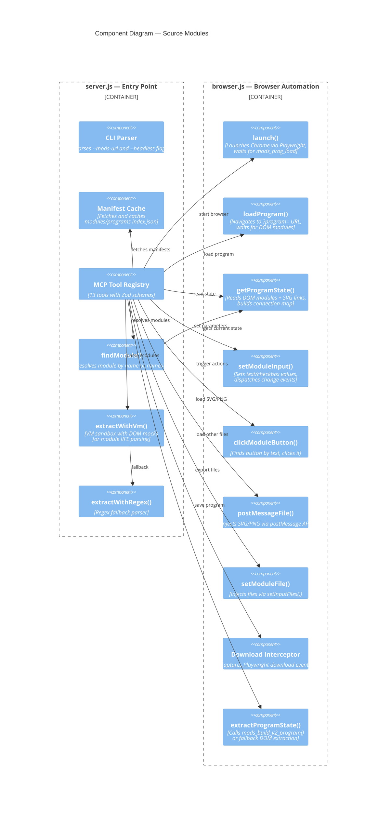
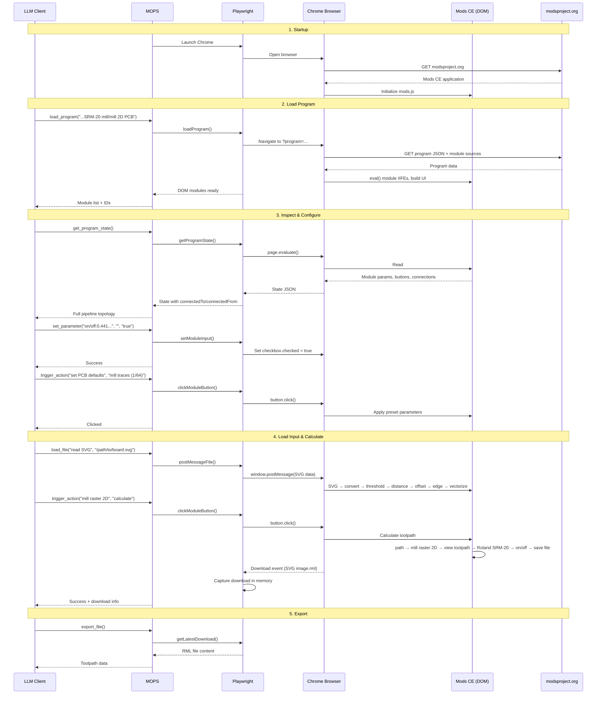
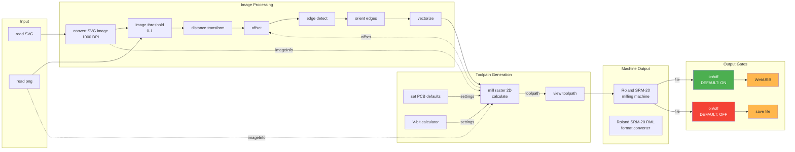

# Architecture

C4 model documentation for MOPS (Machines Obeying Prompt Suggestions).

## Level 1: System Context

Shows how the MCP server fits into the broader ecosystem — who uses it and what external systems it depends on.

## Level 2: Container Diagram

The MCP server process contains two main containers: the MCP protocol handler and a managed browser instance. Modules and programs are fetched from the remote Mods CE deployment.

## Level 3: Component Diagram

Detailed view of the two source modules and how they collaborate.

## Sequence Diagram: PCB Milling Workflow

Shows the complete data flow when an LLM generates a PCB toolpath.

## Data Flow: Mods CE Internal Pipeline

How data flows through a typical PCB milling program inside the Mods CE browser.

## Key Design Decisions

### Why Playwright instead of direct DOM manipulation?

Mods CE was designed as a standalone browser application. Its core runtime (`mods.js`) uses closures, `eval()`, and direct DOM manipulation that make it impossible to run in Node.js. Playwright lets us control the real application exactly as a human would, while also providing:

- **Download interception** for capturing generated toolpath files
- **File injection** via `setInputFiles()` and `postMessage` for loading designs
- **JavaScript evaluation** for reading DOM state and triggering events
- **Page navigation** for loading different programs

### Why a remote deployment instead of a local submodule?

The original architecture bundled Mods CE as a git submodule served via a local HTTP server. The remote-only approach eliminates the submodule dependency, simplifies installation, and means MOPS always uses the latest Mods CE version deployed at [modsproject.org](https://modsproject.org). A custom deployment URL can still be specified via `--mods-url`.

### Why a vm sandbox for module parsing?

Module IIFE source files define their inputs/outputs inside closures. Simple regex extraction misses complex cases (computed types, conditional ports). The Node.js `vm` module lets us evaluate each IIFE in an isolated sandbox with minimal DOM mocks, achieving 100% parse rate without executing any browser-dependent code.

### Why connection topology in get_program_state?

The original state only showed module names, parameters, and buttons — with no indication of how modules connect. This made it impossible for an LLM to distinguish between two `on/off` switches or understand the data flow. By parsing the SVG link elements, we expose `connectedTo` and `connectedFrom` on each module, enabling the LLM to reason about the pipeline.
